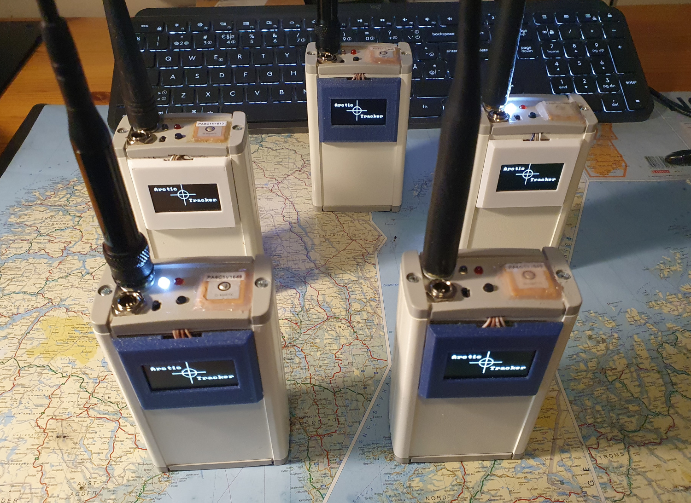
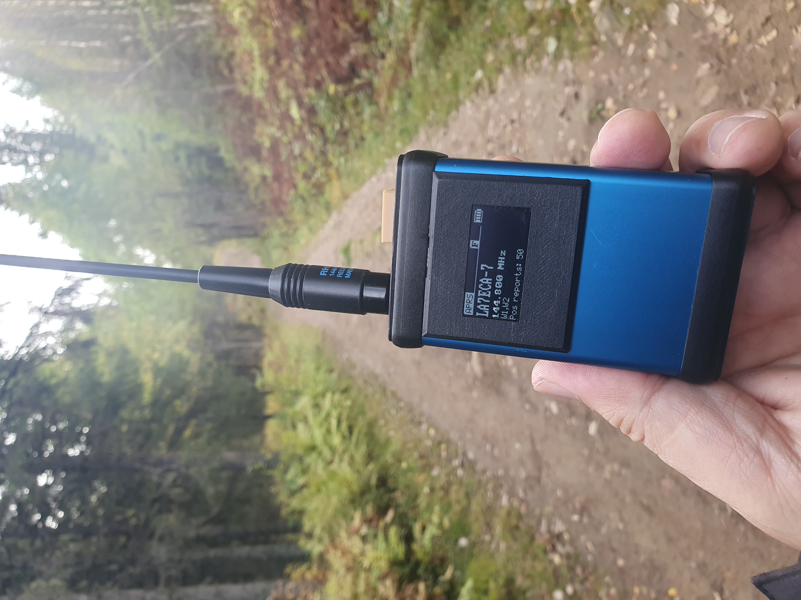
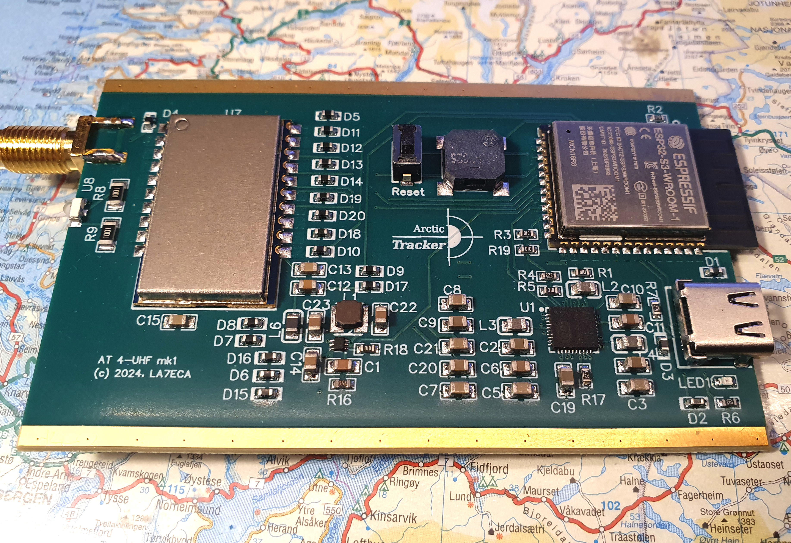
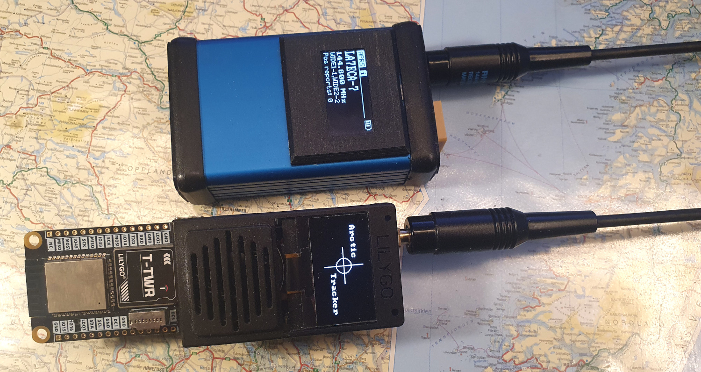

 
**************** 
Hardware Options
****************

Prior versions
--------------
Based on earlier experiences with the `Polaric Tracker <https://www.la3t.no/polarictracker/>`_ and a `need <http://hamlabs.no/2015/04/01/arctictracker/>`_ for a updated tracker we were thinking of a `possible new design <http://hamlabs.no/2015/04/01/towards-a-next-generation-tracker/>`_ that was based on affordable modules and relatively easy to assemble for radio amateurs. It was also to be able to connect the internet (for config, for uploading tracks, to function as a igate,etc). The first lab-models and the `prototype in the first round <http://hamlabs.no/2019/05/13/first-round-of-tracker-project/>`_ were based on a SR-FRS-1 VHF module, a Teensy-3 microcontroller board, a ESP-8266, a Nokia display, etc. The role of the ESP was to control the Wifi and provide a simple webserver for configuration of the tracker. It was programmed in LUA (NodeMCU). It had limited memory and barely room for the webserver. The Teensy was rather capable and able to encode and decode APRS packets, decode GPS NMEA strings and control the whole thing. See `code for the ESP <https://github.com/ohanssen/ArcticTracker-ESP>`_ and `code for the Teensy <https://github.com/Hamlabs/ArcticTracker-Teensy>`_.

Then came the ESP32 and the `second round prototype <http://hamlabs.no/2019/06/23/second-round-of-tracker-project/>`_ was based on this. Some of the software could be ported to the ESP-IDF platform - this was the start of the current codebase. 

After the pandemic there was time for a `critical review <http://hamlabs.no/2022/03/18/arctic-tracker-what-now/>`_ and some options were considered. Some design flaws were discussed and a `third round prototype <http://hamlabs.no/2023/01/10/arctic_third_round/>`_ was designed. It used another display on the outside of the enclosure (with a 3D-printed cover), it added a charger chip for the battery and a USB-C breakout module. It didn't use power from the USB to charge the battery though. It replaced a problematic switch for the PA-module. The plain ESP32 was replaced with a ESP32S3. This tracker worked reasonably well though the battery and charging was problematic. 5 working prototypes were made. 

See all `Hamlabs posts on Arctic Tracker here <http://hamlabs.no/category/projects/at/>`_. 

Arctic Tracker 4 VHF
--------------------
In the fourth round it was decided to make another version of the VHF tracker, but with several changes (some of them inspired by the LilyGo projects): A NiceRF SA868 rado-module was used and the PA was dropped. This means that we could do with a 3.7V battery, a PMU was used to manage power and charging of the battery, a USB-C socket mounted directly on the PCB which was also used for charging and power-supply. A separate 5V DC/DC converter for the radio. A smaller (Hammond) enclosure with 3D printed top and bottom. The whole thing got simpler, but we also decided to design a 4-layer PCB and let the factory in China assemble most of it. Exceptions were the radio module, the antenna plug, the connector on the back and (in the first test-version) also the ESP32 module.

The transmitter yields up to 3 watts output. This may cause the PMU to shut down the tracker if there is too much voltage drop in the battery (it is tested with some old batteries). The TX power can be turned down to about 1 watt from the software. 

There seems to be an issue with the squelch of the SA868, but with the use of a software squelch (for decoding) and the RSSI command for deciding if the channel is clear for transmission, it works well. The SA868 is also open in the sense that alternative (open source) firmware can be flashed to it using contacts on its back-side. Currently we use it with the stock firmware. This may change later.

Arctic Tracker 4 UHF/LoRa
-------------------------
A UHF version (433 MHz) has also been made that can operate on LoRa APRS. It is based on the VHF version where the SA-868 is replaced with a LoRa1268F30-Mini. The 5V regulator is also replaced since the module requires 4V for the transmitter. As soon as LoRa APRS became legal in Norway, i.e. the telecomms authorities opened up for up to 200 kHz bandwidth in the lower part of the 70 cm band, the PCB design was ready to be sent to production.

The UHF version of the tracker can transmit with up to 1 watt output and has an enhanced receiver.

LilyGo T-TWR Plus
-----------------
`LilyGo <https://lilygo.cc>`_ offers a series of innovative open source hardware boards, most of them using the ESP32 and many of them with a radio module (typically LoRa), a GNSS module, etc. One particular board (for radio amateurs) is the T-TWR-plus. Coming with a VHF or UHF radio module, a GNSS module, a ESP32S3, etc. It can be used as a voice-radio, even a digital voice radio (with M17) as done in the OpenRTX project, but also as a APRS tracker as done in the ESP32APRS project. The T-TWR has many similarities with the Arctic Tracker prototype, so I got a question if I could be interested in porting the Arctic Tracker software to it. So I did and this also inspired me to work further with the Arctic Tracker hardware. 

