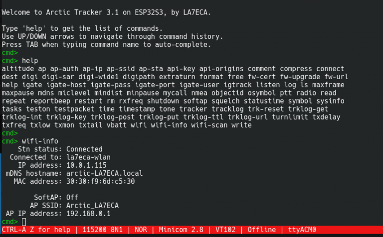

 
Basic setup and use
===================

For first-time setup it is recommended to use the *command shell* (console) as described below. Alternatively, it is possible to activate the soft-AP (use the tracker as an access point) and use the web-app to access the most important settings. It is probably easier to use the web-app after the callsign is set since the callsign is part of the identifier for the tracker. 

Using the command shell
-----------------------
The Arctic Tracker offers a serial console (command shell).  This lets you control every setting and has some commands for testing,  debugging, etc. It is recommended  to use it the first time you start the tracker for setting the wifi  access point, access-key, etc. When you plug in a USB-C cable and connect it to your computer a serial interface should appear. On Linux it is typically */dev/ttyACM0*. On Windows, you can see in the device-manager what COM-port it is mapped to. It is usually *COM3*. A good old serial terminal program (VT102 mode is preferable) should work. On Linux, *Minicom* works well. On Windows, *Putty* is recommended. The monitor command of *idf.py* (if you have the esp-idf installed), should also work. You may need to reset the tracker to get up the command prompt (*cmd>*). 

The ‘help‘ command gives you a list of available commands. ‘help <command>‘ gives a short explanation of the given command. Be sure to set the callsign (‘mycall‘). The ‘tracker’ command turns on or off the tracking function (it is on by default). ‘radio’ command turns on or off the radio (it is on by default). The ‘wifi on’ command turns on the WIFI. The ‘ap’ command lets you set up a list of WIFI access points. The tracker will try to connect to these in order if they are in range. If the first one fails, it will try the next. Also, before you try to use the webapp, use the ‘api-key’ to set a secret key to be used for the webapp to authenticate. If things are working as expected, you should also be able to get to the most important settings with a web-browser.

The 'digipath' (digipeater path) is by default set to 'WIDE1-1', if you need to use multi-hop digipeating it could be set to '"WIDE1-1,WIDE2-2'. 'timestamp' (timestamped packets) and 'compress' (compressed packets) are also on by default. 'symbol' (aprs symtable/overlay and symbol) is by default set to'/[' which means a running person is to be shown on the map.
 
Configuring the Wifi
--------------------
The first time the tracker is used, you could use the 'ap' command to set the access-point to use.::

  ap 1 <ssid> <key>

Up to 6 alternative access-points can be given. First index is 1. The first one will be tried first, if that fails, it will try the next, etc. Give the command 'wifi on' to turn on the wifi. Then it should try to connect. The command 'wifi-info' will return information so you can see if it succeeds to connect, what IP-address it gets, etc.. 

Using the Web App
-----------------

Using the Soft AP
-----------------

