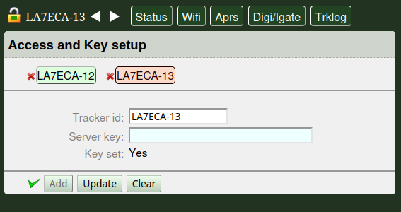
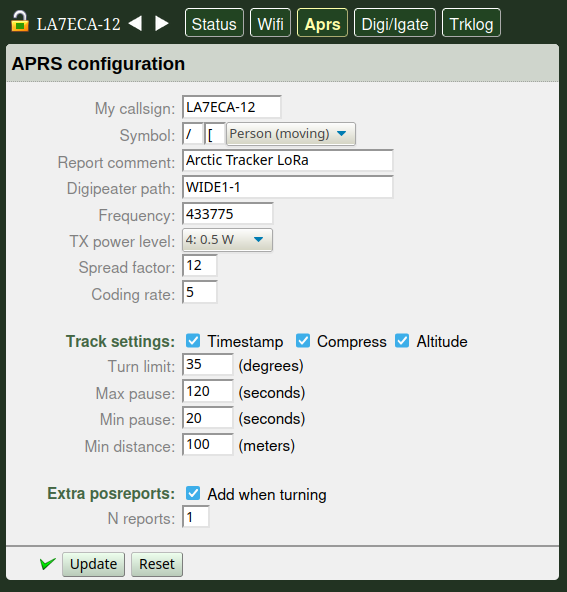

 
Basic setup and use
===================

For first-time setup it is recommended to use the *command shell* (console) as described below. Alternatively, it is possible to activate the soft-AP (use the tracker as an access point) and use the web-app to access the most important settings. It is probably easier to use the web-app after the callsign is set since the callsign is part of the identifier for the tracker. 

Using the command shell
-----------------------
The Arctic Tracker offers a serial console (command shell).  This lets you control every setting and has some commands for testing,  debugging, etc. It is recommended  to use it the first time you start the tracker for setting the wifi  access point, access-key, etc. When you plug in a USB-C cable and connect it to your computer a serial interface should appear. On Linux it is typically */dev/ttyACM0*. On Windows, you can see in the device-manager what COM-port it is mapped to. It is usually *COM3*. A good old serial terminal program (VT102 mode is preferable) should work. On Linux, *Minicom* works well. On Windows, *Putty* is recommended. The monitor command of *idf.py* (if you have the esp-idf installed), should also work. You may need to reset the tracker to get up the command prompt (*cmd>*). 

.. image:: img/console.png

The ‘help‘ command gives you a list of available commands. ‘help <command>‘ gives a short explanation of the given command. Be sure to set the callsign (‘mycall‘). The ‘tracker’ command turns on or off the tracking function (it is on by default). ‘radio’ command turns on or off the radio (it is on by default). The ‘wifi on’ command turns on the WIFI. The ‘ap’ command lets you set up a list of WIFI access points. The tracker will try to connect to these in order if they are in range. If the first one fails, it will try the next. Also, before you try to use the webapp, use the ‘api-key’ to set a secret key to be used for the webapp to authenticate. If things are working as expected, you should also be able to get to the most important settings with a web-browser.

The 'digipath' (digipeater path) is by default set to 'WIDE1-1', if you need to use multi-hop digipeating it could be set to '"WIDE1-1,WIDE2-2'. 'timestamp' (timestamped packets) and 'compress' (compressed packets) are also on by default. 'symbol' (aprs symtable/overlay and symbol) is by default set to'/[' which means a running person is to be shown on the map.
 
Connecting to a Wifi access point
---------------------------------
The first time the tracker is used, you could use the 'ap' command to set the access-point to use.::

  ap 1 <ssid> <key>

Up to 6 alternative access-points can be given. First index is 1. The first one will be tried first, if that fails, it will try the next, etc. When you turn on the wifi it should try to connect to the access point. Use the 'wifi-info' to see if it succeeds to connect, what IP-address it gets, etc.. 

The web-app can also be used to edit the list of access points, the keys, etc.. 

Using the Web App
-----------------
The tracker can be configured using a `web-app <https://github.com/Hamlabs/ArcticTracker-Webapp>`_. It can discover and connect to trackers on the same LAN and it can connect to several trackers at the same time. The first time you connect to a tracker, start the webapp from the tracker itself: Point the browser to 'https://arctic-XXXX.local/' where XXXX is the callsign you gave the tracker. If a callsign is not set, the id of the ESP32 chip will be used. You can also see the hostname on the display or when using the 'wifi-info' command. 

The first time you are opening the webpage on the tracker this way, the browser will complain that its certificate cannot be verified. This is because it is a self-signed certificate and not signed by a known CA. If you feel confident that you are really connecting to your tracker you can add an exception to the browser to let it accept the webpage. Later connections to the same tracker will then work, even if the webapp is coming from somewhere else. 

Now, add the tracker. Click on the lock-icon and fill inn the callsign field and click 'add'. Now, the callsign should appear in a little box on the screen. The first time you access the tracker you also need to add the API-key. On the tracker, this key can be set in the command-shell ('api-key' command) or in the web-app itself. By default it is '123456789'. Please change it at your first convenience. If the correct key is set and we have connected sucessfully to the tracker, the box with the callsign will turn green. 

If the callsign-box does not turn green there may be two reasons: 1: The API key entered is wrong (then it normally turns red instead) or 2: The self-signed SSL-certificate is not known to the browser yet (see above).

If at least one tracker is connected it will automatically discover other trackers on the LAN (using mDNS). To connect to them, click the callsign-box and (if not added earlier) add the API-key. 

The web-app has a menu line with 5 choices (in addition you can select and set up connections to trackers): 

* *Status* - show info on tracker
* *Wifi* - configure Wifi access points, Wifi Soft AP and keys. 
* *Aprs* - Configure callsign, radio frequency, APRS confg like symbol, path, etc..
* *Digi/Igate* - Digipeater and igate setup. 
* *TrkLog* - Track logging setup. Automatic uploading of tracks to a Polaric Server instance.

Using the Soft AP
-----------------
The tracker can also be used as a Wifi access point so that you can connect the web-app to it. It is not activated by default. To activate it use the display menu to just turn it on or use the command::

 softap on

The display ("W-AP" screen) will show information: The SSID of the AP. the IP-address of the tracker. Connect your smartphone or laptop to that SSID. The password is by default '123456789'. Please change it at your first convenience. You may now point your browser to the shown IP or the hostname (shown in the "WIFI" screen). The information can also be shown by using the wifi-info command Use the procedure described above to connect and configure the tracker. If you are using the smartphone app (soon to be announced) it will discover the tracker automatically. You may have to add the API-key if not done before. 

Basic operation and display
---------------------------
The Arctic Tracker has two pushbuttons: One on the bottom to turn it on and off. Press and hold to turn it on or off. The other on the top to operate it. A led gives some indication. Red when it transmits. Blinking green otherwise. Short blinks when GNSS has a fix. Long blinking when not. On the T-TWR it is a little different since there are more buttons (including a rotating knob that can be used to cycle between screens or menu-items) and leds with multiple colours. 

The display gives more information and has 10 screens that you can cycle between them using the pushbutton on the top (short push). On the top of the screen there is a line with a battery indicator on the right side and the name of the screen on the left side. There can be single-letter indications in between: 

* *i* - WIFI and internet connection is active
* *g* - Igate is active 
* *d* - Digipeater is active
* *p* - USB-C is connected with charging or external power supply
* *F* - GNSS Fix on position

The 9 screens are (in addition to the welcome screen):

============= ==========================================================================================
 ``APRS``      Callsign and frequency, APRS path and number of pos reports sent 
 ``RXTX``      Radio information: RX signal level, etc. The LoRA version shows the SF and CR as well 
               as info about the last received packet. 
 ``TIME``      Current date and time. Set by info from the GNSS or NTP (internet). Can show local 
               time if timezone is set. UTC by default
 ``GNSS``      Shows position coordinates if fix. 
 ``WIFI``      Shows if Wifi is connected, SSID of the AP and what IP-address and hostname. 
 ``W-AP``      Shows info about the soft-AP (the tracker can be an access point). SSID, IP-address 
               and number of connected clients. 
 ``BATT``      Battery status. Info about charging. 
 ``SYST``      System information, firmware version
 ``TRKL``      Track log info. Number of stored reports and posted reports if enabled. 
============= ==========================================================================================

Display menu
~~~~~~~~~~~~

Press and hold the button in about one second to activate a menu on the display. You can select one of the items by pushing briefly on the button (or use the rotary knob on the T-TWR) until the desired item is selected and then push and hold it for about one second to confirm. The menu has the following items: 

* Send position report (if GNSS fix)
* Restart.. Reboot the device
* Soft Ap On|Off
* Wifi On|Off
* Igate On|Off
* Digipeater On|Off
* Track logging On|Off
* Firmware upgrade

The On|Off settings shows On or Off depending on the setting. If it is already is off, the menu will show "On" (to allow turning it on). The menu popup will go away when you have cycled through all items. It is of course a good idea to be sure things are configured correctly, using the webapp or the command-shell, before trying to turn them on with this menu. 

