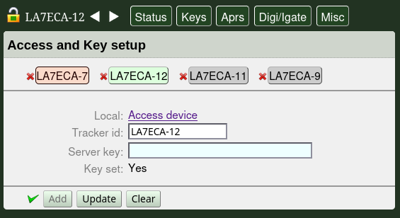
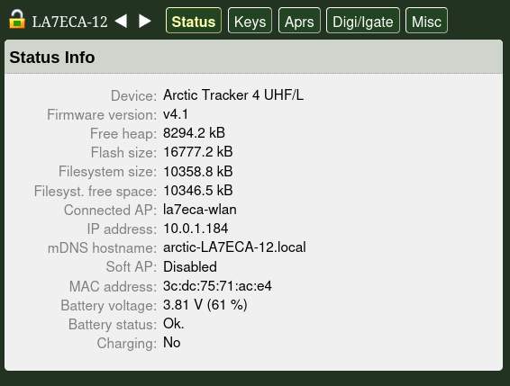
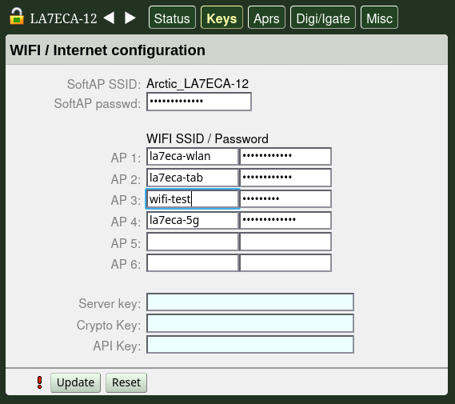
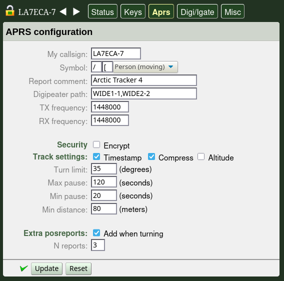
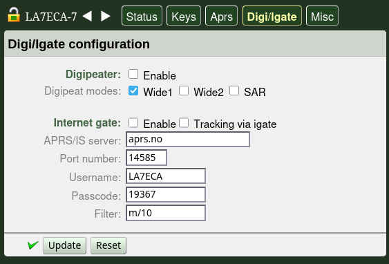
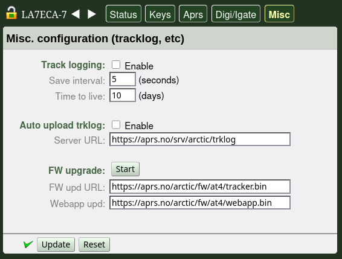

Using the Web App
=================

The tracker can be configured using the `web-app <https://github.com/Hamlabs/ArcticTracker-Webapp>`_. It can discover and connect to trackers on the same LAN and it can connect to several trackers at the same time. The first time you connect to a tracker, start the webapp from the tracker itself: Point the browser to 'https://arctic-XXXX.local/' where XXXX is the callsign you gave the tracker. If the callsign is not set, the id of the ESP32 chip will be used. You can also see the hostname on the display or when using the *'wifi-info'* command. 

Now, add the tracker. Click on the lock-icon and fill inn the callsign field and click 'add'. Now, the callsign should appear in a little box on the screen. The first time you access the tracker you also need to add the API-key. On the tracker, this key can be set in the command-shell ('api-key' command) or in the web-app itself. By default it is '123456789'. Please change it at your first convenience. If the correct key is set and we have connected sucessfully to the tracker (and the certificate is accepted), the box with the callsign will turn green. 

If the callsign-box does not turn green there may be two reasons: 1: The API key entered is wrong (then it normally turns red instead) or 2: The certificate cannot be verified (since it is self-signed and not known to the browser yet).

If at least one tracker is connected it will automatically discover other trackers on the LAN (using mDNS). To connect to them, click the callsign-box and (if not added earlier) add the API-key. Remember that the first time you connect a tracker (or after callsign is changed or certificate changed) connect it directly (a link is provided) to check and accept the certificate.

The first time you open the webpage on the tracker this way, the browser may complain that its certificate cannot be verified. This is because it is a *self-signed certificate* and not signed by a CA known to the browser. If you feel confident that you are really connecting to your tracker you can add an exception to the browser to let it accept the certificate. Later connections to the same tracker will then work, even if the webapp is coming from somewhere else. From version 4.1. the certificate is generated by the tracker itself when started the first time, when the callsign is set or when using the command *'cert-new'*. The certificate's *common-name* (CN) will be based on the ESP32 chip's unique id (it identifies the tracker hardware). The callsign will be provided as well in the OU field. When the tracker connects to a LAN it is announced with mDNS and can be addressed using *Arctic-<callsign>.local* domain name. This name is also put in the certificate.

It is also possible to have the certificate signed by a CA-server (if provided) through an authenticated REST API. A CSR is also generated for this purpose and it is available in the file system for inspection along with the certificate. Note that this is an *experimental* feature. Se also the `Polaric-CertAuth <https://github.com/PolaricServer/Polaric-Certauth>`_ software which can be used as a CA.

Menu items
----------

The web-app has a menu line with 5 choices (in addition you can select and set up connections to trackers). It will show on to the left of the menu buttons the callsign of the tracker we operate on if more than one tracker is connected it is possible to cycle between them: 

* *Status* - show info on tracker
* *Keys* - configure Wifi access points, Wifi Soft AP and keys for encryption/authentication. 
* *Aprs* - Configure callsign, radio frequency, APRS confg like symbol, path, etc..
* *Digi/Igate* - Digipeater and igate setup. 
* *Misc* - Track logging setup (automatic uploading of tracks to a Polaric Server instance). OTA firmware upgrade.

Status tab
~~~~~~~~~~

The status tab just shows some information from the tracker. It inmcludes the firmware version, memory space, connected AP, IPT-address and hostname, battery status, etc.. 

Keys tab
~~~~~~~~

Use this to configure the passwords and keys for Wifi. You can se the SoftAP password, and up to 6 alternatives for Wifi access points to try to connect with SSID and password (key). The access points are tried in order. If AP1 fails, it will try AP 2, etc. 

Also, three security keys (typically passphrases) can be set here: (1) the server key that the tracker will use when connecting to a Polaric Server for tracklogging, (2) the key using for encrypting APRS, and (3) the *API key* that clients (like this webapp) use to connect to the tracker. The keys with light blue fields are one-way. Existing values aren't fetched from the tracker. If you want to change them, just write in the new key.

If something is changed. A red exclamation mark will show. Press "Update" to send the changes to the tracker. If this succeeds a green mark whill show. .

APRS configuration tab
~~~~~~~~~~~~~~~~~~~~~~

Here you set the callsign of the travker, the APRS symbol, digipeater path, frequency, etc. For LoRa trackers you can set the spread-factor and coding-rate. You can add an alternative SF and CR which can be used when a cross-SF digipeater retransmits a packet.

You can turn on timestamp (recommended), compress (recommended) and altitude and set some smart-beaconing parameter. Additional features offered by the Arctic Trackers are encryption and extra posistion reports where you can set the number of extra reports that can be added and if an extra report should be added when changing direction more than the turn-limit. 

Digi/Igate configuration tab
~~~~~~~~~~~~~~~~~~~~~~~~~~~~

Here you can enable the digipeater or the igate. The igate settings includes the APRS-IS server settings. If tracking via igate is on, the position reports from the tracker itself are sent to APRS-IS as if they were igated. When it comes to the digipeater settings, the Wide1 setting is the "fill-in" digipeater mode.

For LoRa trackers it is also possible to set it to digipeat on the alternative SF and CR (if set in the APRS configuration tab). This means that a packet that is received on the primary SF/CR typically SF12/5, can be retransmitted with the alternative SF/CR, for example SF5 which *much* faster but requires a stronger signal.

Misc. configuration tab
~~~~~~~~~~~~~~~~~~~~~~~

Other settings: Track-logging means that positions are logged periodically in the tracker's file system in flash memory. They are logged with the interval set here (e.g. 5 seconds). The time to live configures the maximum time the positions are stored. With track-logging Auto upload should also be enabled. This means that positions are uploaded to a Polaric Server REST API (the server-url must be set). 

In this tab we can configure and initiate OTA firmware upgrade: Two server URLs must be set. One for the tracker firmware and one for the webapp.  Two URLs must be set. Push "Start" to initiate the upgrade but if you have changed the URLs remember to save them first ("Update button) 

